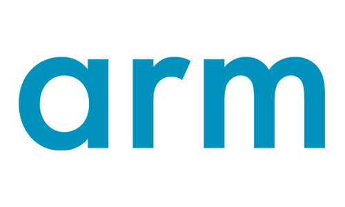
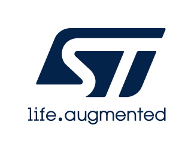

The MCUboot project is an open governance project.  More information
is available on the [project charter](wiki/MCUboot-Project-Charter).
For information on becoming a member, please contact
mcuboot-board@groups.io.

The following are current members of the project:

<figure>

<figcaption>arm</figcaption>
</figure>

<figure>

<figcaption>Cypress</figcaption>
</figure>

<figure>

<figcaption>Linaro</figcaption>
</figure>

<figure>

<figcaption>Nordic Semiconductor</figcaption>
</figure>

<figure>

<figcaption>ST</figcaption>
</figure>
